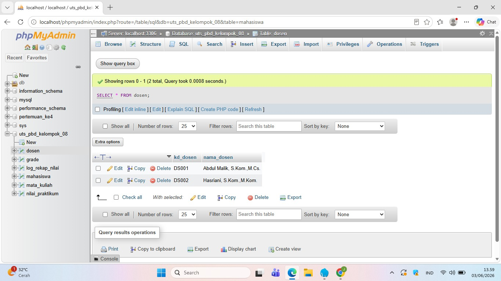
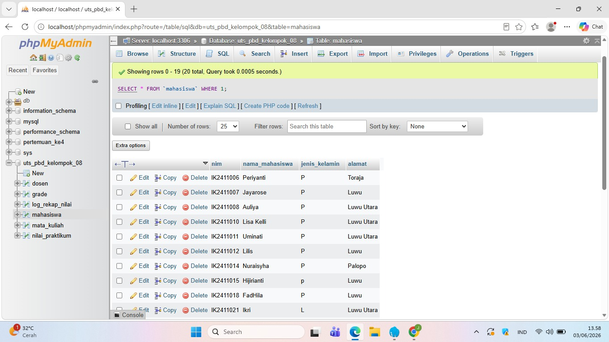
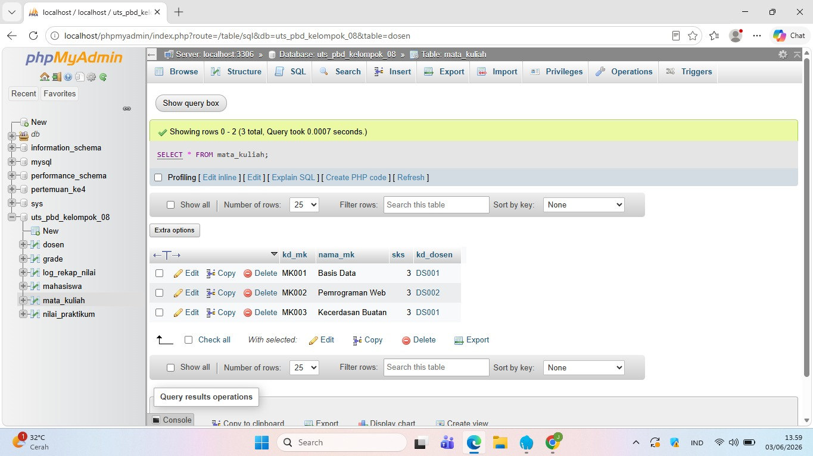
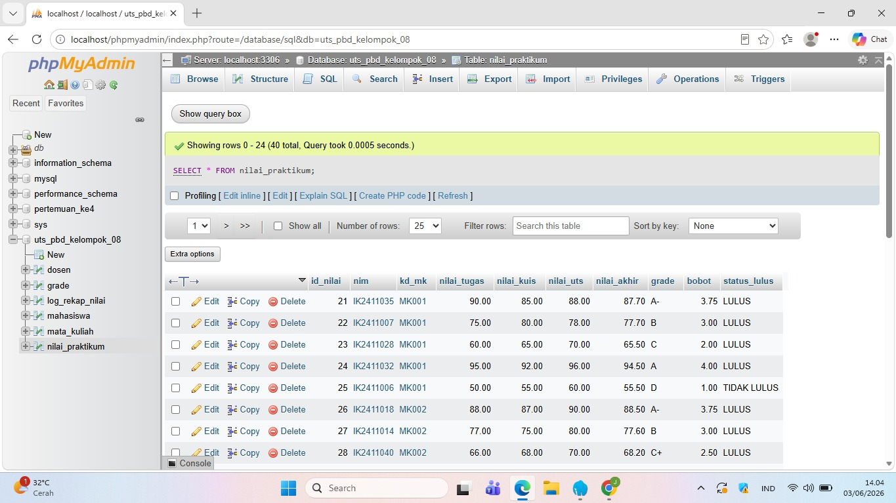
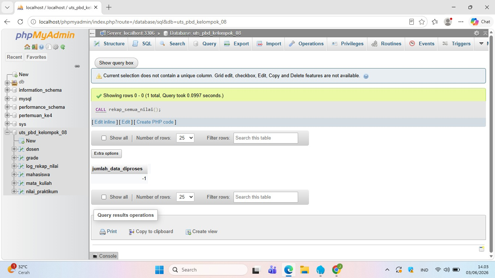
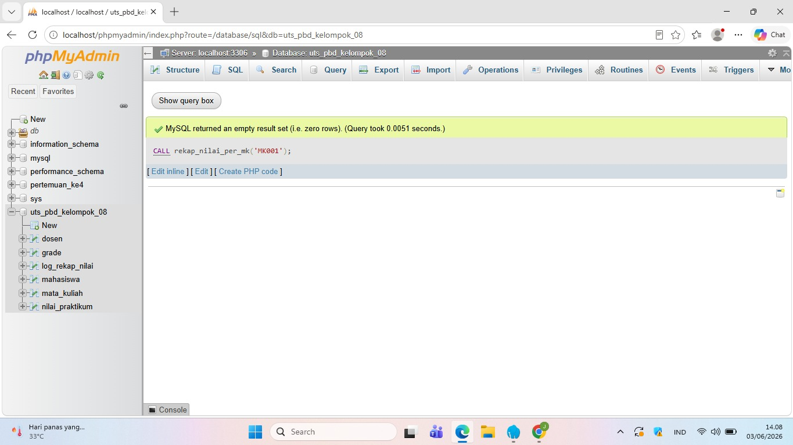

# README

## JUDUL PROYEK: SISTEM REKAP NILAI PRAKTIKUM MAHASISWA

*Sistem Pengolahan Nilai Praktikum Mahasiswa Menggunakan Stored Procedure dan Cursor pada MySQL*

## Nama Kelompok

1. Elghiariel Sima Tonga
2. Mifta Auliya
3. Jaya Rose Bomba O.G
4. Anandari Dewitri

## Deskripsi Sistem

Sistem Pengolahan Nilai Praktikum Mahasiswa merupakan aplikasi berbasis database MySQL yang digunakan untuk mengelola data mahasiswa, dosen, mata kuliah, dan nilai praktikum. Sistem ini mampu menghitung nilai akhir mahasiswa secara otomatis berdasarkan nilai tugas, kuis, dan UTS menggunakan Stored Procedure.

Selain itu, sistem dapat menentukan grade, bobot nilai, status kelulusan mahasiswa, serta menyimpan hasil rekapitulasi ke dalam tabel log menggunakan Cursor dan Procedure pada MySQL.

### Fitur Sistem

* Pengelolaan data dosen
* Pengelolaan data mahasiswa
* Pengelolaan data mata kuliah
* Pengelolaan data grade dan bobot nilai
* Perhitungan nilai akhir otomatis
* Penentuan grade dan bobot nilai
* Penentuan status kelulusan
* Rekap nilai seluruh mahasiswa
* Rekap nilai berdasarkan mata kuliah
* Penyimpanan riwayat proses rekap ke tabel log

## Struktur Tabel

### 1. Tabel dosen

| Field      | Tipe Data    | Keterangan  |
| ---------- | ------------ | ----------- |
| kd_dosen   | VARCHAR(10)  | Primary Key |
| nama_dosen | VARCHAR(100) | Nama dosen  |

### 2. Tabel mahasiswa

| Field          | Tipe Data    | Keterangan       |
| -------------- | ------------ | ---------------- |
| nim            | VARCHAR(10)  | Primary Key      |
| nama_mahasiswa | VARCHAR(100) | Nama mahasiswa   |
| jenis_kelamin  | CHAR(1)      | L/P              |
| alamat         | VARCHAR(100) | Alamat mahasiswa |

### 3. Tabel mata_kuliah

| Field    | Tipe Data    | Keterangan           |
| -------- | ------------ | -------------------- |
| kd_mk    | VARCHAR(10)  | Primary Key          |
| nama_mk  | VARCHAR(100) | Nama mata kuliah     |
| sks      | INT          | Jumlah SKS           |
| kd_dosen | VARCHAR(10)  | Foreign Key ke dosen |

### 4. Tabel grade

| Field | Tipe Data    | Keterangan  |
| ----- | ------------ | ----------- |
| grade | CHAR(2)      | Primary Key |
| bobot | DECIMAL(3,2) | Bobot nilai |

### 5. Tabel nilai_praktikum

| Field        | Tipe Data    | Keterangan        |
| ------------ | ------------ | ----------------- |
| id_nilai     | INT          | Primary Key       |
| nim          | VARCHAR(10)  | FK ke mahasiswa   |
| kd_mk        | VARCHAR(10)  | FK ke mata_kuliah |
| nilai_tugas  | DECIMAL(5,2) | Nilai tugas       |
| nilai_kuis   | DECIMAL(5,2) | Nilai kuis        |
| nilai_uts    | DECIMAL(5,2) | Nilai UTS         |
| nilai_akhir  | DECIMAL(5,2) | Hasil perhitungan |
| grade        | CHAR(2)      | Grade mahasiswa   |
| bobot        | DECIMAL(3,2) | Bobot grade       |
| status_lulus | VARCHAR(20)  | Status kelulusan  |

### 6. Tabel log_rekap_nilai

| Field          | Tipe Data    | Keterangan       |
| -------------- | ------------ | ---------------- |
| id_log         | INT          | Primary Key      |
| tanggal_proses | DATETIME     | Waktu proses     |
| nim            | VARCHAR(10)  | NIM mahasiswa    |
| kd_mk          | VARCHAR(10)  | Kode mata kuliah |
| nilai_akhir    | DECIMAL(5,2) | Nilai akhir      |
| grade          | CHAR(2)      | Grade            |
| status_lulus   | VARCHAR(20)  | Status kelulusan |

## Cara Menjalankan Program

### Langkah 1

Buat database baru pada MySQL.

sql
CREATE DATABASE db_nilai_praktikum;
USE db_nilai_praktikum;

### Langkah 2

Jalankan seluruh script CREATE TABLE.

### Langkah 3

Masukkan data awal menggunakan perintah INSERT INTO.

### Langkah 4

Buat Stored Procedure yang telah disediakan.

### Langkah 5

Jalankan procedure rekap seluruh nilai.

sql
CALL rekap_semua_nilai();

### Langkah 6

Lihat hasil perhitungan nilai.

sql
SELECT * FROM nilai_praktikum;

### Langkah 7

Lihat data log rekap.

sql
SELECT * FROM log_rekap_nilai;

### Langkah 8

Untuk merekap berdasarkan mata kuliah tertentu.

sql
CALL rekap_nilai_per_mk('MK001');

## Daftar Stored Procedure

### 1. rekap_semua_nilai()

Fungsi:

* Menggunakan Explicit Cursor
* Membaca seluruh data nilai praktikum
* Menghitung nilai akhir
* Menentukan grade
* Menentukan bobot nilai
* Menentukan status kelulusan
* Mengupdate tabel nilai_praktikum
* Menyimpan hasil rekap ke tabel log_rekap_nilai

### Rumus Nilai Akhir

Nilai Akhir =

* 30% Nilai Tugas
* 30% Nilai Kuis
* 40% Nilai UTS

### 2. rekap_nilai_per_mk(p_kd_mk)

Parameter:

sql
p_kd_mk VARCHAR(10)

Fungsi:

* Menampilkan dan merekap nilai berdasarkan kode mata kuliah tertentu.
* Menyimpan hasil rekap ke tabel log_rekap_nilai.

Contoh:

sql
CALL rekap_nilai_per_mk('MK001');

## Pembagian Tugas Anggota

### Elghiariel Sima Tonga

* Membuat database
* Membuat tabel
* Membuat relasi antar tabel
* Membuat Stored Procedure
* Membuat Cursor
* Membuat log rekap nilai

### Mifta Auliya

* Membuat perhitungan nilai akhir
* Menentukan rumus nilai akhir
* Membuat dokumentasi sistem
* Menyusun README proyek

### Jaya Rose Bomba O.G

* Menginput data mahasiswa
* Menginput data nilai praktikum
* Melakukan pengujian data
* Validasi hasil perhitungan nilai

### Anandari Dewitri

* Menentukan grade dan bobot nilai
* Menentukan status kelulusan
* Membantu pengujian program
* Menyusun laporan hasil proyek

## Kesimpulan

Sistem ini berhasil mengimplementasikan konsep database relasional, stored procedure, percabangan, perulangan, explicit cursor, 
dan pencatatan log pada MySQL untuk membantu proses pengolahan nilai praktikum mahasiswa secara otomatis dan lebih efisien.
# Screenshot Hasil Program

## Data Dosen

## Data Mahasiswa

## Data Mata Kuliah

## Data Nilai Praktikum

## Hasil Rekap Semua Nilai

## Hasil Rekap Per Mata Kuliah

## Log Rekap Nilai

